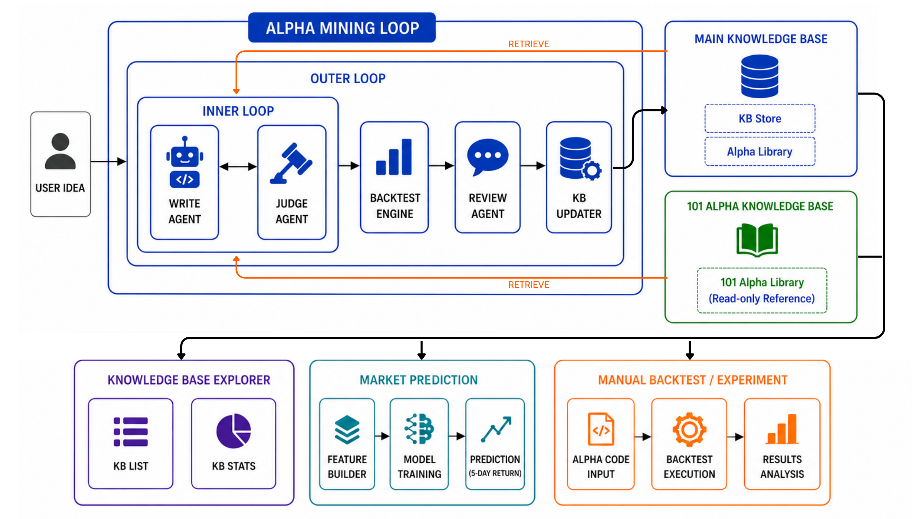
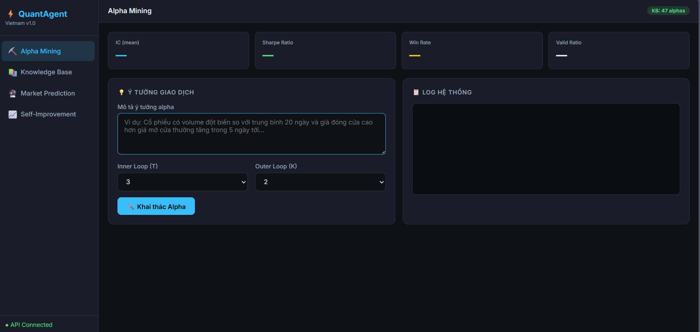

# LLM-Based Alpha Mining with Knowledge Accumulation

An automated system that uses Large Language Models (LLMs) to discover, evaluate, and store quantitative trading signals for the Vietnamese stock market.

---


## System Architecture



| Component | Role |
|---|---|
| `WriterAgent` | Generates alpha code from trading idea + KB context |
| `JudgeAgent` | Reviews code quality before backtesting |
| `BacktestEngine` | Runs historical backtest, computes IC, Sharpe, Win Rate |
| `ReviewerAgent` | Analyzes backtest results, gives feedback for next round |
| `Main KB` | Stores validated alphas from previous runs |
| `101 Alpha KB` | Read reference of WorldQuant 101 Formulaic Alphas |

---

## Knowledge Base Retrieval

Both knowledge bases are queried at each inner loop step using cosine similarity with `all-MiniLM-L6-v2` embeddings:

- **Main KB** → similar validated alphas from past runs
- **101 Alpha KB** → formula patterns from WorldQuant 101 Alphas

---

## Web Interface



The dashboard allows users to:
- Enter a trading idea in natural language
- Set inner loop (T) and outer loop (K) parameters
- Start the alpha mining process with one click
- View real time logs and results (IC, Sharpe, Win Rate, Valid Ratio)

| Tab | Description |
|---|---|
| Alpha Mining | Input trading idea and run the full pipeline |
| Knowledge Base | Browse and filter stored alphas (KB List, KB Stats) |
| Market Prediction | Train model and get 5-day return forecast |
| Manual Backtest | Test custom alpha code and view results |

---

## Models 

| Component | Model |
|---|---|
| WriterAgent | Llama-4-Scout-17B-16E (Groq API) |
| JudgeAgent | LLaMA-3.1-8B (Groq API) |
| ReviewerAgent | LLaMA-3.1-8B (Groq API) |
| Embeddings | all-MiniLM-L6-v2 |

---

## Alpha Interface

All alphas follow the `AlphaBase` interface:

```python
class MyAlpha(AlphaBase):
    inputs = ["close", "volume"]

    def calc(self, data):
        signal = ...          # compute raw signal
        signal = signal.clip(-5, 5)
        signal = signal.fillna(0)
        return signal
```

---

## Features

- **Alpha Mining** — Generate and refine alpha factors from natural language ideas
- **Backtesting** — Evaluate alphas on historical data with IC, Sharpe, Win Rate, Max Drawdown
- **Knowledge Base** — Store and reuse successful alphas across runs
- **Market Prediction** — Combine high-quality alphas for 5 days return forecasting
- **Manual Backtest** — Test custom alpha code via dashboard


---


## Authors

- **Vu Minh Son** — 23020424
- **Pham The Trung** — 23020442

Supervisor: **Dr. Tran Hong Viet**
Institute for Artificial Intelligence, University of Engineering and Technology, Vietnam National University, Hanoi, Vietnam
